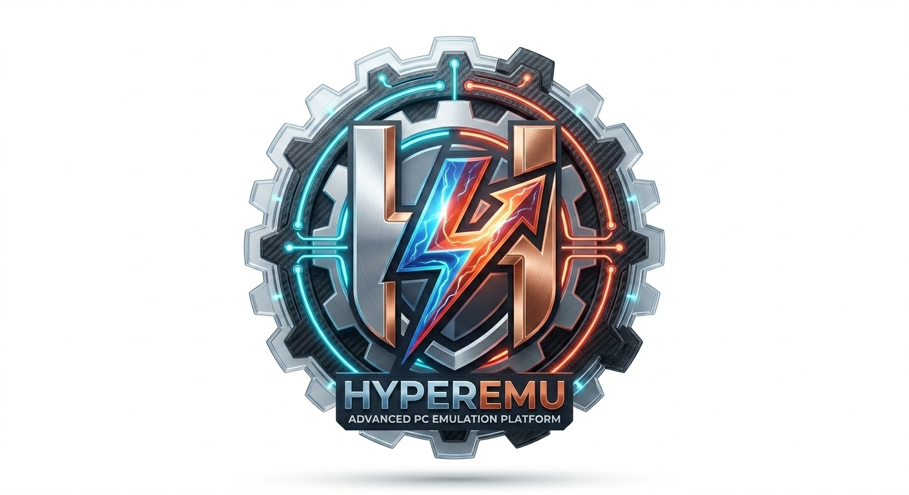

# HyperEmu

**Advanced PC Emulation Platform by HYPER Company**



## Description

HyperEmu is an ultra-optimized Android application that allows you to run Windows (x86_64) applications using Wine and Box86/Box64.

Built on Winlator 11 core with major enhancements:
- 🎮 **Steam, GOG Galaxy, Amazon Games** integration
- ⚡ **HyperOptimizer** — BOX64 JIT tuning, DXVK Async, CPU/GPU governor
- 🎨 **Dark gaming UI** — Purple + Cyan theme
- 📦 Ultra-optimized build (ProGuard + shrink resources)

## Installation

1. Download the latest APK from the [Releases](../../releases) section.
2. On Android: Settings → Security → **Unknown sources** → Enable
3. Open the downloaded APK and install.

## Requirements

- Android 8.0+ (API level 26)
- ARM64 processor (arm64-v8a)
- 4GB+ RAM recommended
- Vulkan support recommended

## Build from Source

```bash
# Clone the repo
git clone https://github.com/YOUR_USERNAME/hyperemu.git
cd hyperemu

# Build (requires Android Studio or JDK 17 + Android SDK)
./gradlew assembleDebug
```

Or use **GitHub Actions** — push a tag to trigger an automated build:

```bash
git tag v1.0
git push origin v1.0
```

The APK will appear in the [Releases](../../releases) section automatically.

## Credits

- Based on [Winlator](https://github.com/brunodev85/winlator) by brunodev85
- Wine, Box86, Box64, DXVK, VirGL
- Developed by **Ramin İbişzadə** / HYPER Company

## License

MIT License — see [LICENSE](LICENSE)
